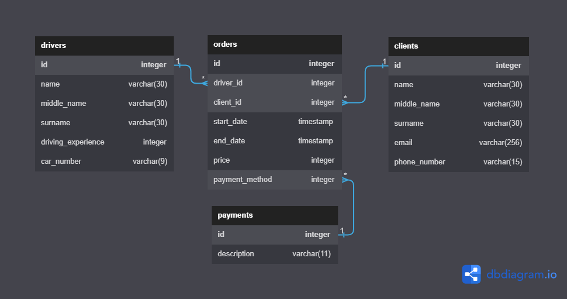

### Описание предметной области:
**Упрощенный аналог такси**

* Композиция состоит из трех объектов:
  - Водитель. Свойства:
    1. уникальный идентификатор - id
    2. имя - name 
    3. отчество - middleName
    4. фамилия - surname
    5. стаж вождения - drivingExperience
    6. номер машины - carNumber

  - Клиент. Свойства:
    1. уникальный идентификатор - id
    2. имя - name
    3. отчество - middleName
    4. фамилия - surname
    5. номер телефона - phoneNumber
    6. электронная почта - email

  - Заказ. Свойства:
    1. уникальный идентификатор - id
    2. идентификатор клиента - clientId
    3. идентификатор водителя - driverId
    4. дата начала заказа - start_date
    5. дата окончания заказа - end_date
    6. способ оплаты - payment_method

### Схема БД


* Схема состоит из 4 таблиц:
  - drivers
  - clients
  - orders
  - payments

  Каждый объект соответвует одноименной таблице в БД. Таблица payments хранит информацию о способах оплаты.

  **Связи между таблицами обозначены линиями:**
  - *-1 связь many to one

### Описание зависимостей, подключенных в проект:
1. spring-boot-starter-web - для создания веб-приложений, в том числе RESTful, с использованием Spring MVC;
2. spring-boot-starter-data-jpa - для использования Spring Data JPA с Hibernate;
3. lombok - позволяет сократить шаблонный код с использованием аннотаций (@Getter, @Setter, @ToString и др.);
4. postgresql - драйвер JDBC для PostgreSQL;
5. commons-valiator - для проверки корректности данных на стороне клиента.

### Инструкция для запуска приложения
Для корректной работы приложения необходимо наличие на компьютере Docker. Список команд:
```
git clone https://github.com/mikhaylenko-sd/JavaTrainee.git \\склонировать репозиторий по ссылке из GitHub
mvn install \\собрать проект
docker-compose up \\запустить контейнеры, описанные в docker-compose.yml
docker-compose stop \\остановить контейнеры
```


